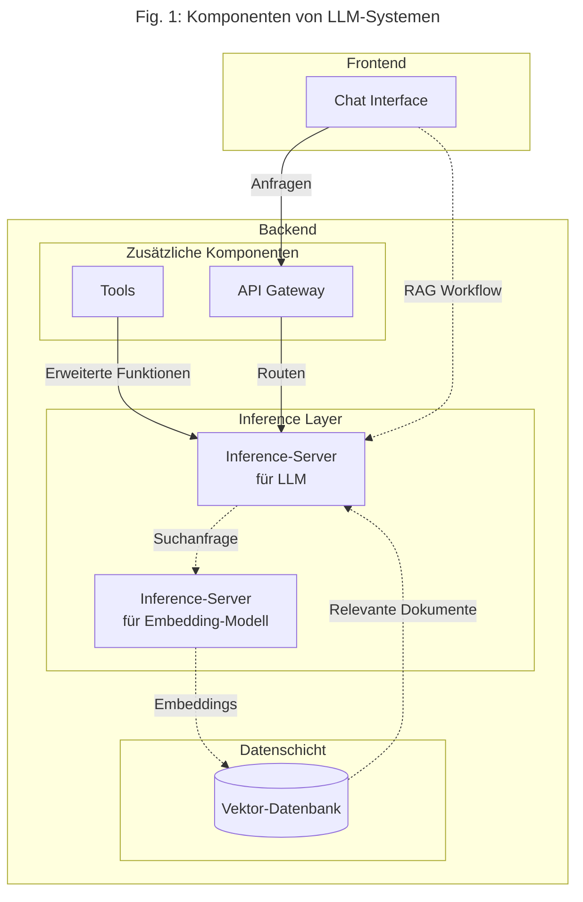

# Einleitung, Überblick und Definitionen

Dieses Material entstand auf der Grundlage eines Vortrags[^1] über Self-Hosting von LLMs, der auf dem [Datenfestival](https://www.youtube.com/watch?v=exOeJCLcuHQ) des [Civic Data Lab](https://civic-data.de/) gehalten wurde. Es soll den Vortrag zugänglicher machen, umfassend über das Thema informieren und einen praxisorientierten Überblick geben.

Unter Self-Hosting wird der (auf unterschiedlichen Leveln) eigenständige Betrieb von Infrastruktur verstanden, auf der in diesem Fall LLMs und mit diesen zusammenhängende Software läuft.

## Was ist ein LLM?

LLMs (Large Language Models) sind große neuronale Sprachmodelle. Sie basieren auf neuronalen Netzwerken – mathematischen Strukturen, die aus vielen miteinander verbundenen Schichten bestehen. Diese Modelle werden durch die Anpassung von Millionen oder sogar Milliarden von Parametern trainiert, die zusammen mit der Modellarchitektur das fertige Modell definieren.

Die Textgenerierung erfolgt durch zahlreiche Matrizenrechnungen, die sich besonders effizient auf spezialisierter Hardware wie GPUs ausführen lassen. **Open-Weight-Modelle** sind als Dateien verfügbar, die sowohl die Architektur als auch die trainierten Parameter eines Modells enthalten – sie können daher selbst gehostet werden.

## Warum Self-Hosting?

Die Nutzung proprietärer LLM-Dienste ist mit  **Abhängigkeiten**, **Intransparenz** und mangelnder **Kontrolle** verbunden. Bei kommerziellen Anbietern bleibt unklar, wie Daten tatsächlich verarbeitet werden, wie die Modelle trainiert wurden und welche Eigenschaften sie besitzen. Auch die Funktionsweise eingebundener Tools wie Websuche sowie der tatsächliche Ressourcenverbrauch sind nicht nachvollziehbar. Self-Hosting adressiert diese Problematik und trägt zur **digitalen Souveränität** bei: Organisationen und Privatpersonen erlangen vollständige Transparenz und Kontrolle über alle Aspekte des LLM-Betriebs – von der Datenverarbeitung über die Modellauswahl bis hin zum Energie- und Ressourcenverbrauch.

## Worauf wird selbst gehostet?

Self-Hosting kann an verschiedenen Orten erfolgen:

- **Lokal (On-Premises)**: Betrieb auf dem eigenen Laptop oder auf dedizierten Servern, die in den Räumlichkeiten einer Organisation oder Privatperson stehen. Dies bedeutet volle Kontrolle über das Setup, aber auch volle Verantwortung für Hardware und Wartung.
- **Cloud**: Server werden in verschiedenen Formen von Cloud-Providern zur Miete angeboten – entweder als virtualisierte Maschine (VM) oder als dedizierte physische Maschine (Bare Metal). Flexibel skalierbar, aber mit laufenden Kosten.
- **Hybrid (Co-Hosting)**: Kauf eigener Server, die jedoch in den Räumen eines Cloud-Providers betrieben und gewartet werden. Kombination aus Eigentum und professioneller Infrastruktur.

## Was wird selbst gehostet?

Im Falle des Self-Hostings von LLM-Systemen stellt sich die Frage, welche Komponenten man selbst betreiben will. Hier lässt sich zwischen **Frontend** und **Backend** unterscheiden:

**Frontend**: Meistens ein Chat Interface, über das Nutzer:innen mit dem LLM interagieren.

**Backend**: Umfasst mehrere Komponenten:
- **Inference-Server**: Software, auf der ein LLM betrieben wird. Auf solchen Servern können sowohl generative LLMs als auch Embedding-Modelle betrieben werden.
- **Vektor-Datenbank**: Wird für RAG (Retrieval-Augmented Generation) benötigt. RAG ergänzt informationsbezogene Anfragen an das LLM mit relevanten Dokumenten aus einem Suchschritt mithilfe einer Datenbank.
- **API Gateway**: Verwaltet und standardisiert den Zugriff auf die verschiedenen Backend-Dienste
- Zusätzliche Dienste wie Authentifizierung und Dateipeicher

**RAG im Detail**: Bei RAG wird semantische Suche verwendet. Dabei verarbeitet ein Embedding-Modell Texte zu sogenannten Embeddings. Embeddings sind Vektore, die den Textinhalt in numerischer Form repräsentieren. Diese Embeddings ermöglichen es, inhaltlich ähnliche Dokumente zu finden und dem LLM als Kontext bereitzustellen.

**Fig. 1** bietet einen graphischen Überblick über die Komponenten und deren Zusammenspiel:

## Aufbau der Dokumentation

Die folgenden Kapitel vertiefen die hier eingeführten Konzepte systematisch:

**[Open LLMs](./01-models.md)** erklärt den Unterschied zwischen Open-Weight- und Open-Source-Modellen, gibt einen Überblick über Lizenzmodelle und deren Implikationen, erläutert Quantisierung als zentrale Optimierungstechnik, stellt Hugging Face als primäre Bezugsquelle vor und beschreibt gängige Metriken und Benchmarks zur Modellbewertung.

**[Hosting-Infrastruktur](./02-infra.md)** vergleicht detailliert die verschiedenen Infrastrukturoptionen – von lokalen Servern über Cloud-Lösungen bis zu hybriden Ansätzen. Das Kapitel behandelt Hardware-Anforderungen (CPU vs. GPU, VRAM-Größen, GPU-Generationen) sowie Aspekte wie Energieeffizienz, Kühlungssysteme und langfristige Kostenbetrachtungen.

**[Hosting-Software](./03-software.md)** stellt konkrete Software-Komponenten für die verschiedenen Teile eines LLM-Systems vor – von Inference-Servern über Chat-Interfaces bis zu API-Gateways und Vektor-Datenbanken. Als praktisches Beispiel wird Parrotpark vorgestellt, ein vollständiges self-gehostetes LLM-System, das die Integration verschiedener Open-Source-Komponenten demonstriert.

**[Alternativen](./03-alternatives.md)** diskutiert abschließend Alternativen zum vollständigen Self-Hosting, einschließlich hybrider Ansätze und kommerzieller Lösungen mit verschiedenen Compliance-Leveln.

[^1]: Die Slides des Vortrags lassen sich [hier](https://correlaid.github.io/datenfestival_ap3_session/) finden, begleitender Code [hier](https://github.com/CorrelAid/datenfestival_ap3_session).
