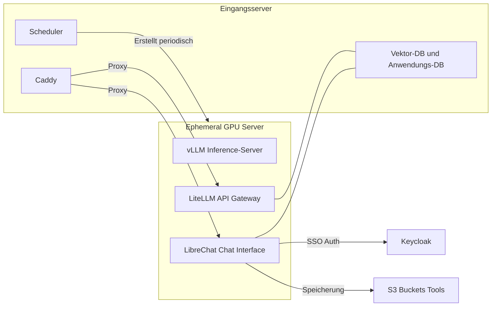

# Was wird (wofür) selbst gehostet?

Im Falle des Self-Hostings von LLM-Systemen stellt sich die Frage, welche Komponenten man neben dem LLM an sich selbst betreiben will. Dies hängt ähnlich wie die Auswahl des Modells vom konkreten Einsatzzweck ab. Der häufigste Wunsch ist eine Art privates Chat-GPT, also ein KI-Assistent mit unterschiedlichen Fähigkeiten mit dem man über eine grafische Oberfläche chatten kann. Während andere Arten von LLM-Systemen möglich sind, sollen hier die Komponenten eines solchen Assistenten beschrieben werden. 

Grundfunktionalitäten solcher KI-Systeme sind oft:

- **RAG**: Bei RAG wird meistens **semantische Suche** verwendet. Dabei verarbeitet ein LLM Texte zu sogenannten Embeddings. Embeddings sind Vektoren, die den Textinhalt in numerischer Form repräsentieren. Diese Embeddings ermöglichen es, inhaltlich ähnliche Dokumente zu finden und dem LLM als Kontext bereitzustellen.

- **Tools**: Hierbei handelt es sich um eine dem LLM externe Code-Komponente, die das LLM über ein spezielles Interface (heutzutage meistens [MCP](https://modelcontextprotocol.io/docs/getting-started/intro)) nutzen kann.

- **Multimodalität**: Es können auch Bilder oder PDFs hochgeladen werden, die Teil des Inputs an das LLM sind

Zunächst lässt sich zwischen **Frontend** (die Software, die Nutzer:innen sehen und oft direkt im Browser läuft) und **Backend** (Software, mit der Nutzer:innen nicht direkt interagieren) unterscheiden.

**Frontend**: Meistens ein Chat Interface, über das Nutzer:innen Input an das LLM-System senden und Output anzeigen.

**Backend**: 

- **Inference-Server**: Software, auf der ein LLM betrieben wird. Auf solchen Servern können sowohl generative LLMs als auch Embedding-Modelle betrieben werden.
- **Vektor-Datenbank**: Wird für RAG (Retrieval-Augmented Generation) benötigt. RAG ergänzt informationsbezogene Anfragen an LLMs mit relevanten Dokumenten aus einem Suchschritt mithilfe einer Datenbank.
- **API Gateway**: Verwaltet und standardisiert den Zugriff auf die Inference-Server
- **MCP-Server**: Hier werden die Tools gehostet, die das LLM nutzen kann
- Zusätzliche Dienste wie Authentifizierung und Dateipeicher

## Parrotpark

**Fig. 1** zeigt ein Beispiel für ein vollständiges Setup. Parrotpark[^1] besteht aus zwei Servern:

- **Eingangsserver**: Permanenter Server, der Proxy, Datenbanken und einen Scheduler hostet
- **Ephemerer GPU Server**: Wird vom Scheduler regelmäßig neu erstellt und hostet die rechenintensiven LLM-Komponenten

## Open Source Software für LLM-Assistenten

Im Gegensatz zu den meisten Open LLMs ist die begleitende Software komplett Open Source. Am häufigsten wird solche Software über die ebenfalls Open Source Technologie der Containerisierung (mit [Docker](https://www.docker.com/) und Docker Compose) betrieben. Bei Parrotpark eingesetzt und miteinander verbunden:

- **Chat Interface**: [LibreChat](https://www.librechat.ai/)
- **Inference-Server**: [vLLM](https://docs.vllm.ai/en/latest/) (für generatives LLM und Embedding-Modell)
- **Vektor-Datenbank**: [pgvector](https://github.com/pgvector/pgvector)
- **API Gateway**: [LiteLLM](https://www.litellm.ai/) – ermöglicht mehr Kontrolle (z.B. Token-Verwaltung) und standardisiert die API
- **Authentifizierung**: [Keycloak](https://www.keycloak.org/) für User-Verwaltung und SSO (Single Sign-On)
- **Anwendungsdatenbank**: Speichert Chatverläufe und Nutzereinstellungen für LibreChat und LiteLLM
- **Proxy**: [Caddy](https://caddyserver.com/) – regelt SSL-Verschlüsselung für HTTPS und leitet Anfragen weiter
- S3-Buckets für Dateispeicherung, Scheduler für automatische Server-Verwaltung

## Übersicht weiterer Open-Source-Software

Neben den bei Parrotpark eingesetzten Komponenten gibt es zahlreiche weitere Open-Source-Alternativen für die verschiedenen Bereiche eines selbst gehosteten LLM-Systems:

### Chat Interface

- **[Open WebUI](https://github.com/open-webui/open-webui)**: Vollständiges, selbst-hostbares Web-Interface mit ChatGPT-ähnlicher Oberfläche, Multi-User-Support, Dokumenten-Upload und RAG-Integration
- **[text-generation-webui](https://github.com/oobabooga/text-generation-webui)**: Feature-reiches Interface mit vielen Anpassungsmöglichkeiten, besonders für Power-User

### Inference Server

- **[vLLM](https://github.com/vllm-project/vllm)**: Hochperformanter Inference-Server mit PagedAttention für effizientes Memory-Management. 
- **[Ollama](https://github.com/ollama/ollama)**: Einfach zu nutzender Server mit One-Command-Installation und automatischem Modell-Download
- **[llama.cpp](https://github.com/ggerganov/llama.cpp)**: CPU-optimierter Inference-Server in C++, läuft auch ohne GPU
- **[LM Studio](https://lmstudio.ai/)**: Desktop-Anwendung mit GUI für lokales Modell-Management 
- **[TGI (Text Generation Inference)](https://github.com/huggingface/text-generation-inference)**: Server von Hugging Face

### Vektor Datenbank

- **[Chroma](https://github.com/chroma-core/chroma)**
- **[Qdrant](https://github.com/qdrant/qdrant)**
- **[Milvus](https://github.com/milvus-io/milvus)**
- **[Weaviate](https://github.com/weaviate/weaviate)**

[^1]: Mehr Informationen zu Parrotpark [hier](https://github.com/CorrelAid/parrotpark).