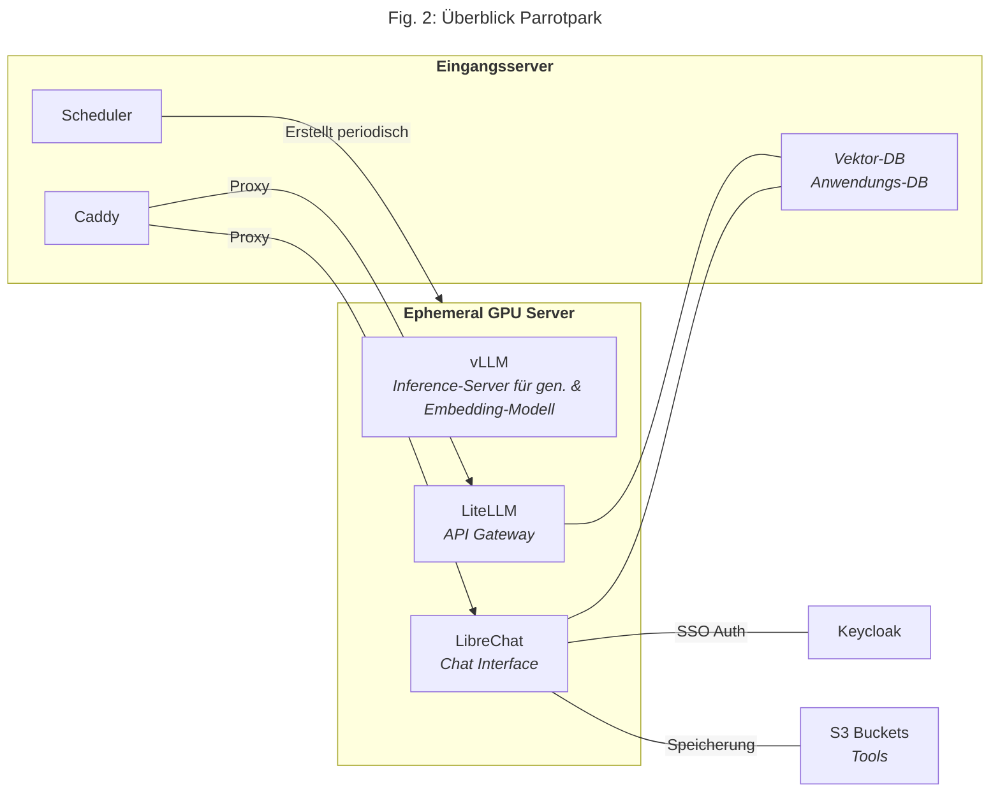

# Hosting-Software

- many active open source solutions

**Fig. 1** zeigt ein konkretes Beispiel: Parrotpark[^1], ein komplett self-gehostetes LLM-System. Die Infrastruktur besteht aus zwei Servern:
- **Eingangsserver**: Permanenter Server, der Proxy, Datenbanken und einen Scheduler hostet
- **Ephemerer GPU Server**: Wird vom Scheduler regelmäßig neu erstellt und hostet die rechenintensiven LLM-Komponenten

Während nicht jedes Self-Hosting Setup so komplex sein muss, zeigt dieses Beispiel die verschiedenen Komponenten einer Komplettlösung.

**Konkrete Software-Komponenten in Parrotpark**:
- **Chat Interface**: [LibreChat](https://www.librechat.ai/)
- **Inference-Server**: [vLLM](https://docs.vllm.ai/en/latest/) (für generatives LLM und Embedding-Modell)
- **Vektor-Datenbank**: [pgvector](https://github.com/pgvector/pgvector)
- **API Gateway**: [LiteLLM](https://www.litellm.ai/) – ermöglicht mehr Kontrolle (z.B. Token-Verwaltung) und standardisiert die API
- **Authentifizierung**: Keycloak für User-Verwaltung und SSO (Single Sign-On)
- **Anwendungsdatenbank**: Speichert Chatverläufe und Nutzereinstellungen für LibreChat und LiteLLM
- **Proxy**: Caddy – regelt SSL-Verschlüsselung für HTTPS und leitet Anfragen weiter
- S3-Buckets für Dateispeicherung, Scheduler für automatische Server-Verwaltung

[^1]: Mehr Informationen zu Parrotpark [hier](https://github.com/CorrelAid/parrotpark).